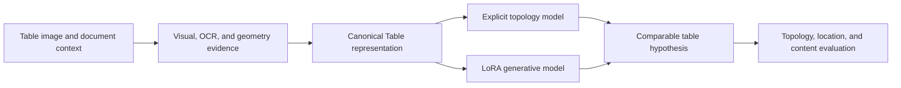

# Borderless Table Structuring Lab

Research infrastructure for auditable borderless-table structure recognition,
Canonical Table supervision, safe Raw MinerU refinement, and independent
Explicit and LoRA candidate routes.

This repository is designed as the long-lived project home. The initial
revision contains the data-engineering and safety-integration layers only. It
does **not** contain model weights, training payloads, terminal benchmark pages,
Customer50 artifacts, or per-sample terminal predictions.

## Table of contents

- [Research objective](#research-objective)
- [Current repository scope](#current-repository-scope)
- [Repository layout](#repository-layout)
- [System design](#system-design)
- [Data strategy](#data-strategy)
- [Installation](#installation)
- [Tests](#tests)
- [Reproducibility and evidence](#reproducibility-and-evidence)
- [Collaboration workflow](#collaboration-workflow)
- [Roadmap](#roadmap)
- [Governance and licensing](#governance-and-licensing)

## Research objective

The project targets table-quality improvement under the OmniDocBench document
parsing protocol while preserving the Raw MinerU document baseline. The core
engineering principle is selective, auditable table correction:

1. Raw MinerU remains the default output.
2. The Explicit route may propose minimal topology-only corrections with Raw
   OCR text frozen.
3. The LoRA route may propose one complete, table-only Canonical Table state.
4. Both routes pass through the same legality, token-preservation, geometry,
   provenance, expected-gain, assembly, and exact-Raw-rollback controls.
5. Unsafe or unsupported candidates are rejected without modifying Raw.

The target of Table TEDS above 95 is an engineering objective, not a guaranteed
unobserved result. Public benchmark-aware development and independent terminal
generalization must be reported separately.

## Current repository scope

Included in the first revision:

- Canonical Table normalization and structural label utilities.
- Direct-state and order-invariant target compilation.
- Candidate-integrity checks.
- Shared fail-closed validation and deterministic Raw rollback.
- Explicit topology-only and LoRA complete-table candidate interfaces.
- Synthetic unit fixtures and regression tests.
- Canonical record schema.
- Evidence Cards and the active execution contract.
- Dataset governance, storage, reproducibility, and collaborator handoff
  documentation.
- Public OTSL normalization and fixed-denominator paired-metric utilities.
- Synthetic-data provenance guidance and manifest validation.

Explicitly excluded:

- Model implementations, adapters, checkpoints, or weights.
- Full training corpora or rendered sample payloads.
- Formal20k source records and compiled record payloads.
- Customer50 content.
- OmniDocBench pages, crops, annotations, recognized strings, coordinates,
  HTML, LaTeX, page identifiers, or Gold records.
- Per-sample terminal predictions or case-selection artifacts.
Research on recovering table structure from weak or absent visual boundaries.
The repository brings together canonical table representations, controlled
data generation, explicit topology modeling, and parameter-efficient
generative adaptation in a shared experimental framework.

## Overview

Borderless tables rarely expose their structure through ruling lines alone.
Their latent grid must be inferred from alignment, spacing, typography,
semantic grouping, spanning cells, and document context. Small structural
errors can then propagate into reading order, cell ownership, and content
alignment.

This lab studies the problem at three connected levels:

- **Representation:** how to describe topology, geometry, and content without
  tying the target to one arbitrary edit sequence.
- **Learning:** how explicit structural prediction and generative adaptation
  behave under the same data and evaluation conditions.
- **Data:** how to construct reproducible, source-traceable corpora that expose
  structural phenomena systematically rather than through incidental examples.

OmniDocBench is used as one document-parsing evaluation protocol. The methods
and infrastructure in this repository are designed around the broader research
problem of table structure recognition.

## Research snapshot 2026.08.13.1

The `2026.08.13.1` snapshot establishes the shared representation and
deterministic 40,000-record corpus foundation for two independent modeling
tracks. The sealed shared corpus has 28,000 training, 8,000 development, and
4,000 holdout records; it balances exact KEEP, hard KEEP, single minimal-edit,
and complex-correction categories, with counterfactual groups and isolated
roles. It includes Canonical Table normalization, order-invariant topology
targets, candidate-integrity checks, deterministic font provenance, and
data-free regression tests. Model checkpoints and dataset payloads are
maintained outside this repository.

The Explicit adapter and its E0 assurance have passed. Its E1 real-data local
smoke is in preparation. The LoRA model-free adapter has passed; its L0
processor and token audit is in preparation. Neither route has completed a
local training smoke or full training.

Project-authored releases follow calendar versioning:

- research snapshots: `2026.08.12`, `2026.09.03`, and so on;
- same-day revisions: `2026.08.12.1`, `2026.08.12.2`, `2026.08.12.3`,
  `2026.08.12.4`, and so on;
- model artifacts: `explicit-2026.08.12` and `lora-2026.08.12`.

External software and benchmark releases retain their original upstream names.
The complete naming convention is documented in
[CONTRIBUTING.md](CONTRIBUTING.md#calendar-versioning).

## Research tracks

### Explicit Layout Transformer

The explicit track treats a table as a structured object and predicts sparse,
order-invariant topology changes. Text, geometry, and cell ownership remain
separate signals so that a structural hypothesis can be inspected and replayed.
The current repository includes a topology-only candidate representation,
default KEEP behavior, frozen OCR-token projection, minimal split/merge
interfaces, shared validation primitives, and exact Raw rollback on a failed
candidate.

See [Explicit Layout Transformer](docs/methods/EXPLICIT_LAYOUT_TRANSFORMER_2026.08.12.1.md).

### LoRA Table Model

The generative track studies parameter-efficient adaptation for direct
Canonical Table prediction with a frozen visual path and language-decoder
adapters. Instead of imitating one serialized sequence of split and merge
actions, the model produces one complete table-only hypothesis that is strictly
parsed, evaluated through the shared safety validator, and rolled back exactly
to Raw when it is unsafe.

The LoRA implementation and ablation studies are maintained as an independent
research contribution and are integrated through the shared Canonical Table
interface.

## Shared experimental foundation



The common foundation provides:

- a canonical representation of rows, columns, spans, text, and geometry;
- direct-state and order-invariant structural supervision;
- deterministic rendering and synthetic-phenomenon generation;
- token-ownership and geometry-integrity checks;
- reproducible manifests, hashes, split isolation, and evidence records;
- route-independent metrics, including GriTS and TEDS-compatible adapters.

## Repository layout

```text
borderless-table-structuring-lab/
├── dataset/                   # External dataset registry; no payloads
├── docs/
│   ├── corpus/                # CalVer data specifications and policies
│   ├── experiment-records/    # Sealed public research evidence
│   ├── methods/               # CalVer research-track formulations
│   └── REPRODUCIBILITY_2026.08.12.1.md
├── configs/                   # Calendar-versioned generation parameters
├── schemas/                   # Calendar-versioned record schemas
├── scripts/                   # Calendar-versioned corpus entry points
├── src/borderless_table_structuring/
│   ├── canonical.py           # Canonical table normalization
│   ├── shared_corpus.py       # Streaming shared-corpus build and audit
│   ├── explicit.py            # Public Explicit-route interface
│   ├── candidate_interfaces.py
│   ├── candidate_integrity.py
│   ├── labels.py
│   └── safety_layer.py
└── tests/                     # Synthetic, data-free regression tests
```

The research tracks use the model names **Explicit Layout Transformer** and
**LoRA Table Model**. Project-authored identifiers use the same calendar
release as the surrounding research snapshot.

## Canonical Table representation

A record connects the rendered observation to an explicit table state:

- logical grid dimensions and cell spans;
- physical cell geometry;
- OCR tokens, confidence, and unique cell ownership;
- source, renderer, template, and content provenance;
- deterministic generation parameters and hashes;
- direct Canonical Table supervision;
- an order-invariant structural difference when a prior state is available.

Ordered action programs may be retained for analysis, but they are not treated
as the unique description of a correct table.

## Data methodology

The data pipeline is designed to vary structure and appearance independently.
Structural families include hierarchical headers, row and column spans,
mixed-dimensional spans, empty cells, and localized split/merge corrections.
Rendering families cover border visibility, typography, resolution, rotation,
compression, blur, background, and scanning artifacts.

Dataset roles are assigned by document, template, content, renderer, and seed
families before rendering. Exact and near-duplicate audits operate on images,
text, normalized structure, geometry, and provenance. See the
[shared-corpus specification](docs/corpus/SHARED_CORPUS_SPECIFICATION_2026.08.12.md)
and [data governance guide](docs/corpus/DATA_GOVERNANCE_2026.08.12.1.md).

## Installation

Python 3.10 or newer is required.

```bash
git clone https://github.com/DearKarl/borderless-table-structuring-lab.git
cd borderless-table-structuring-lab
python -m venv .venv
source .venv/bin/activate
python -m pip install --upgrade pip
python -m pip install -e '.[dev]'
# Add Pillow-backed terminal-blind rendering and perceptual-overlap audits.
python -m pip install -e '.[dev,synthesis]'
```

Run the data-free test suite:

```bash
pytest
```

Generate the bounded synthetic-data smoke into a new external payload path:

```bash
python scripts/generate_data_smoke_2026.08.12.4.py \
  --output /absolute/path/to/data-smoke-2026.08.12.4
```

After independently verifying that sealed smoke, build the preregistered
shared corpus into a different new external path:

```bash
python scripts/build_shared_corpus_2026.08.12.py \
  --output /absolute/path/to/shared-corpus-2026.08.12
```

The builder is CPU-first, streams the 40,000 records, and refuses an existing
output path. Use `--verify-only` for an independent payload and checksum pass.

## Reproducible research

Experiments record the code revision, schema release, immutable data revision,
root manifest hash, configuration hash, random seeds, environment, metrics,
and complete failure accounting. Dataset payloads and model weights are stored
outside Git; this repository contains the code, schemas, manifests, and
documentation needed to reproduce them.

For details, see [Reproducibility](docs/REPRODUCIBILITY_2026.08.12.1.md) and
[Dataset Storage and Sharing](docs/corpus/DATASET_STORAGE_AND_SHARING_2026.08.12.1.md).

Detailed requirements are documented in
[REPRODUCIBILITY.md](docs/REPRODUCIBILITY.md). The bounded KEEP-majority pair
contract, exact-Raw baseline, streaming family audit, and fail-closed perceptual
overlap gate are described in
[RAW_PRESERVING_SMOKE.md](docs/RAW_PRESERVING_SMOKE.md).

The two model tracks share representations and evaluation but keep model code
and ablations independent. Suggested branch prefixes are:

- `explicit/` for explicit topology modeling;
- `lora/` for generative adaptation and ablations;
- `data/` for corpus construction and validation;
- `eval/` for route-independent metrics and analysis.

Contributions should include tests, a concise method note, and the provenance
or experimental metadata needed to interpret the result. Large datasets,
weights, credentials, and benchmark payloads must not be committed.

See [CONTRIBUTING.md](CONTRIBUTING.md) for the review workflow.

## Citation

A project citation will be added with the first archival release. Until then,
please cite the repository URL and the immutable commit used in an experiment.

## License

No public redistribution license has been assigned yet. Third-party datasets,
fonts, evaluators, and pretrained models remain subject to their original
licenses. Consult the repository maintainers before redistributing code or
derived assets.
