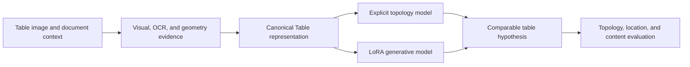

# Borderless Table Structuring Lab

Research on recovering table structure from weak or absent visual boundaries.
The repository brings together canonical table representations, controlled
data generation, explicit topology modeling, and parameter-efficient
generative adaptation in a shared experimental framework.

## Overview

Borderless tables rarely expose their structure through ruling lines alone.
Their latent grid must be inferred from alignment, spacing, typography,
semantic grouping, spanning cells, and document context. Small structural
errors can then propagate into reading order, cell ownership, and content
alignment.

This lab studies the problem at three connected levels:

- **Representation:** how to describe topology, geometry, and content without
  tying the target to one arbitrary edit sequence.
- **Learning:** how explicit structural prediction and generative adaptation
  behave under the same data and evaluation conditions.
- **Data:** how to construct reproducible, source-traceable corpora that expose
  structural phenomena systematically rather than through incidental examples.

OmniDocBench is used as one document-parsing evaluation protocol. The methods
and infrastructure in this repository are designed around the broader research
problem of table structure recognition.

## Research snapshot 2026.08.12.1

The `2026.08.12.1` snapshot establishes the shared representation, evaluation,
and synthetic-corpus specification for two independent modeling tracks. It
includes Canonical Table normalization, order-invariant topology targets,
candidate-integrity checks, table-only model interfaces, a frozen 256-record
generator-smoke design, and data-free regression tests. Model checkpoints and
dataset payloads are maintained outside this repository.

Project-authored releases follow calendar versioning:

- research snapshots: `2026.08.12`, `2026.09.03`, and so on;
- same-day revisions: `2026.08.12.1`, `2026.08.12.2`, and so on;
- model artifacts: `explicit-2026.08.12` and `lora-2026.08.12`.

External software and benchmark releases retain their original upstream names.
The complete naming convention is documented in
[CONTRIBUTING.md](CONTRIBUTING.md#calendar-versioning).

## Research tracks

### Explicit Layout Transformer

The explicit track treats a table as a structured object and predicts sparse,
order-invariant topology changes. Text, geometry, and cell ownership remain
separate signals so that a structural hypothesis can be inspected and replayed.
The current repository includes the candidate representation, reversible
interface, and validation primitives needed by the model.

See [Explicit Layout Transformer](docs/methods/EXPLICIT_LAYOUT_TRANSFORMER_2026.08.12.1.md).

### LoRA Table Model

The generative track studies parameter-efficient adaptation for direct
Canonical Table prediction. Instead of imitating one serialized sequence of
split and merge actions, the model produces a complete table hypothesis that
can be evaluated against the same representation and metrics as the explicit
track.

The LoRA implementation and ablation studies are maintained as an independent
research contribution and are integrated through the shared Canonical Table
interface.

## Shared experimental foundation



The common foundation provides:

- a canonical representation of rows, columns, spans, text, and geometry;
- direct-state and order-invariant structural supervision;
- deterministic rendering and synthetic-phenomenon generation;
- token-ownership and geometry-integrity checks;
- reproducible manifests, hashes, split isolation, and evidence records;
- route-independent metrics, including GriTS and TEDS-compatible adapters.

## Repository layout

```text
borderless-table-structuring-lab/
├── dataset/                   # External dataset registry; no payloads
├── docs/
│   ├── corpus/                # CalVer data specifications and policies
│   ├── experiment-records/    # Sealed public research evidence
│   ├── methods/               # CalVer research-track formulations
│   └── REPRODUCIBILITY_2026.08.12.1.md
├── configs/                   # Calendar-versioned generation parameters
├── schemas/                   # Calendar-versioned record schemas
├── src/borderless_table_structuring/
│   ├── canonical.py           # Canonical table normalization
│   ├── explicit.py            # Public Explicit-route interface
│   ├── candidate_interfaces.py
│   ├── candidate_integrity.py
│   ├── labels.py
│   └── safety_layer.py
└── tests/                     # Synthetic, data-free regression tests
```

The research tracks use the model names **Explicit Layout Transformer** and
**LoRA Table Model**. Project-authored identifiers use the same calendar
release as the surrounding research snapshot.

## Canonical Table representation

A record connects the rendered observation to an explicit table state:

- logical grid dimensions and cell spans;
- physical cell geometry;
- OCR tokens, confidence, and unique cell ownership;
- source, renderer, template, and content provenance;
- deterministic generation parameters and hashes;
- direct Canonical Table supervision;
- an order-invariant structural difference when a prior state is available.

Ordered action programs may be retained for analysis, but they are not treated
as the unique description of a correct table.

## Data methodology

The data pipeline is designed to vary structure and appearance independently.
Structural families include hierarchical headers, row and column spans,
mixed-dimensional spans, empty cells, and localized split/merge corrections.
Rendering families cover border visibility, typography, resolution, rotation,
compression, blur, background, and scanning artifacts.

Dataset roles are assigned by document, template, content, renderer, and seed
families before rendering. Exact and near-duplicate audits operate on images,
text, normalized structure, geometry, and provenance. See the
[synthetic data specification](docs/corpus/SYNTHETIC_DATA_SPECIFICATION_2026.08.12.1.md)
and [data governance guide](docs/corpus/DATA_GOVERNANCE_2026.08.12.1.md).

## Installation

Python 3.10 or newer is required.

```bash
git clone https://github.com/DearKarl/borderless-table-structuring-lab.git
cd borderless-table-structuring-lab
python -m venv .venv
source .venv/bin/activate
python -m pip install --upgrade pip
python -m pip install -e '.[dev]'
```

Run the data-free test suite:

```bash
pytest
```

## Reproducible research

Experiments record the code revision, schema release, immutable data revision,
root manifest hash, configuration hash, random seeds, environment, metrics,
and complete failure accounting. Dataset payloads and model weights are stored
outside Git; this repository contains the code, schemas, manifests, and
documentation needed to reproduce them.

For details, see [Reproducibility](docs/REPRODUCIBILITY_2026.08.12.1.md) and
[Dataset Storage and Sharing](docs/corpus/DATASET_STORAGE_AND_SHARING_2026.08.12.1.md).

## Collaboration

The two model tracks share representations and evaluation but keep model code
and ablations independent. Suggested branch prefixes are:

- `explicit/` for explicit topology modeling;
- `lora/` for generative adaptation and ablations;
- `data/` for corpus construction and validation;
- `eval/` for route-independent metrics and analysis.

Contributions should include tests, a concise method note, and the provenance
or experimental metadata needed to interpret the result. Large datasets,
weights, credentials, and benchmark payloads must not be committed.

See [CONTRIBUTING.md](CONTRIBUTING.md) for the review workflow.

## Citation

A project citation will be added with the first archival release. Until then,
please cite the repository URL and the immutable commit used in an experiment.

## License

No public redistribution license has been assigned yet. Third-party datasets,
fonts, evaluators, and pretrained models remain subject to their original
licenses. Consult the repository maintainers before redistributing code or
derived assets.
