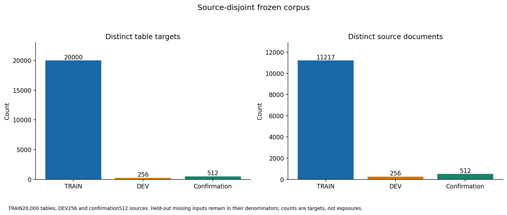
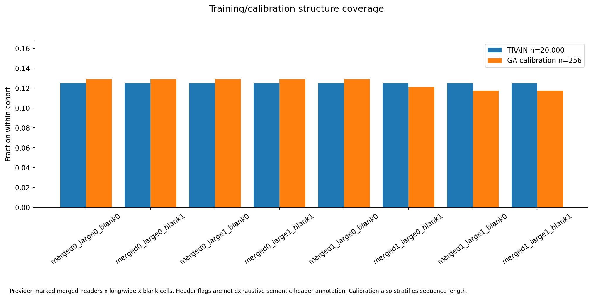
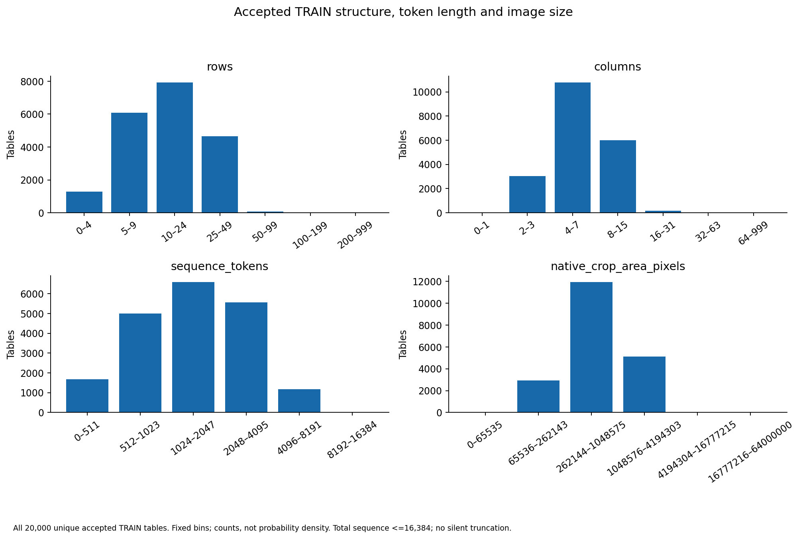
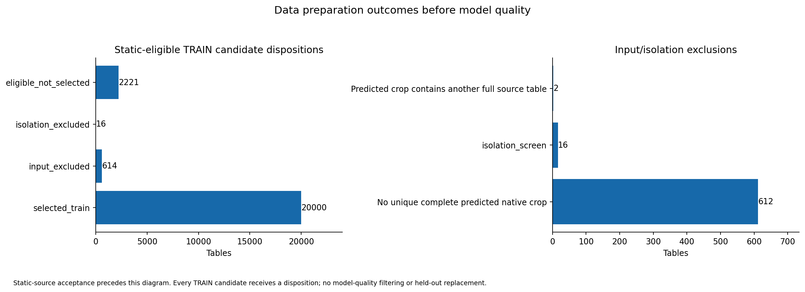

# V8 frozen dataset figures

These figures describe the actual frozen corpus. They are not training-loss or
accuracy curves. Full TRAIN has 20,000 tables; held-out missing inputs remain in
the 256-source DEV and 512-source confirmation denominators.

The eight labels encode provider-marked merged column headers, long/wide tables
(at least 25 rows or eight columns), and explicit blank cells. Each TRAIN stratum
has 2,500 tables. GA calibration additionally stratifies sequence length, so its
structure proportions need not be identical. Provider flags are not exhaustive
semantic-header annotation.

Histogram bins show counts, not probability density; all 20,000 TRAIN examples
are represented in every distribution. Sequence length includes the full input
and target, with a ceiling of 16,384 tokens and no truncation.

Input and isolation exclusions precede any recognition-quality observation.
Eligible unselected tables are omitted by the frozen sampling rule, not because
of model quality. Near-duplicate screening is heuristic. The 200 visual reviews
come from the first eligible tranche and were reconciled with final membership;
they are not independent human review or a uniform sample of the final corpus.

Every figure has an adjacent SVG export. Numeric evidence is in
[split composition](dataset/metrics/split_composition.csv),
[structure/calibration counts](dataset/metrics/structure_calibration_coverage.csv),
[histogram counts](dataset/metrics/training_distributions.csv),
[TRAIN input dispositions](dataset/metrics/input_flow.json), and the
[frozen aggregate summary](DATASET_FROZEN_SUMMARY.json).
