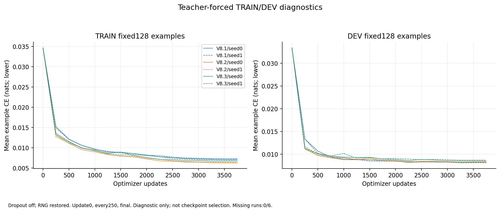
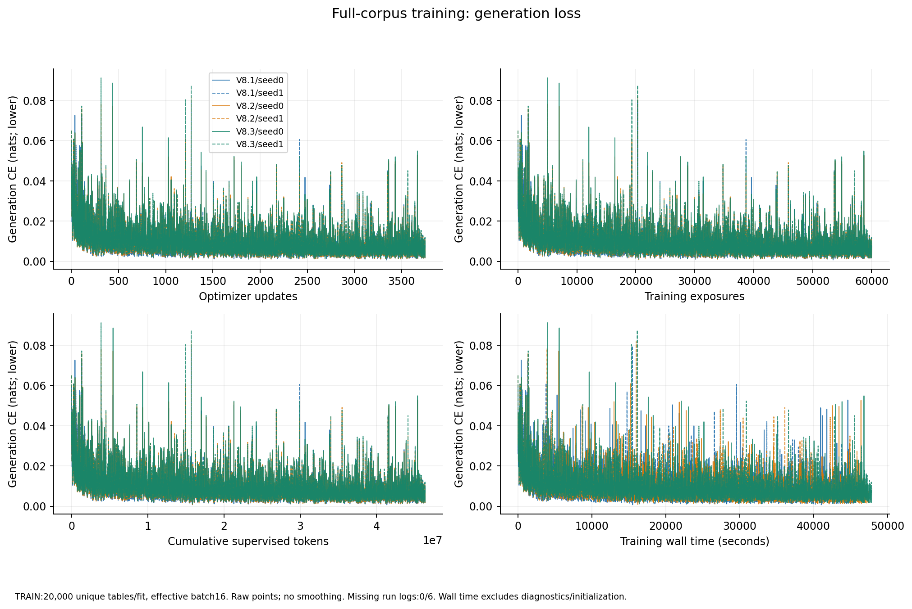
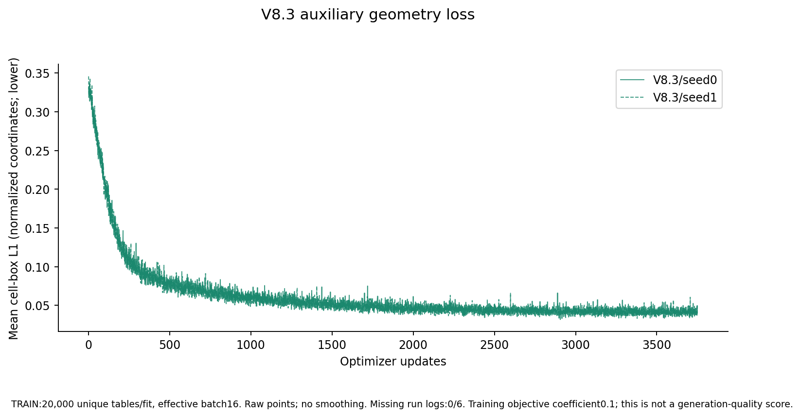
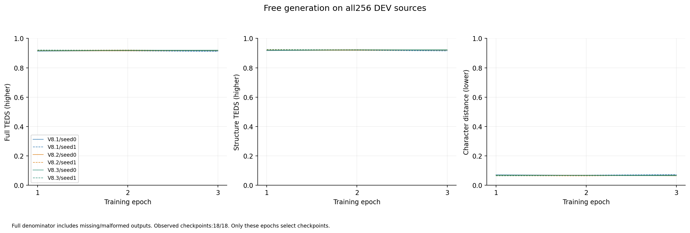
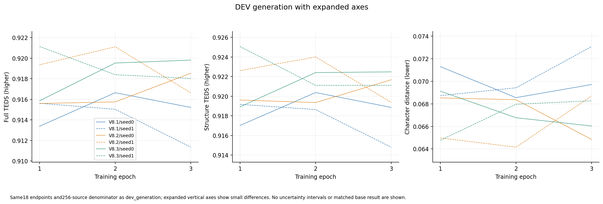
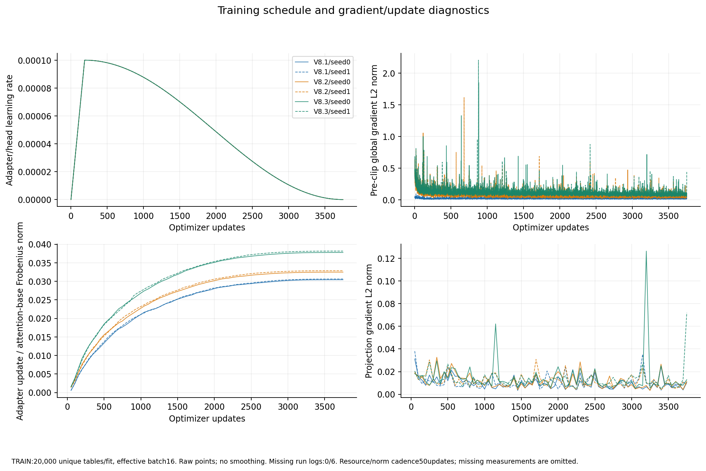
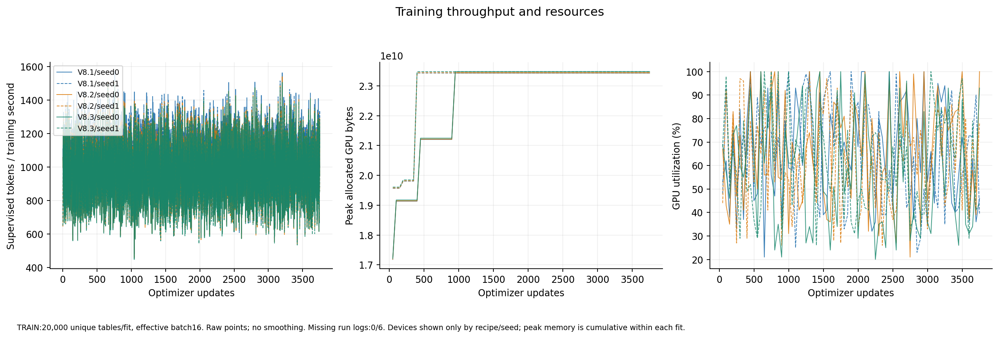

# V8 completed training and DEV checkpoint selection

Snapshot: October 10, 2026. All six fits completed the frozen 3,750-update
schedule, with 20,000 unique tables, 60,000 training exposures and 46,376,895
supervised target tokens per fit. All 18 epoch checkpoints completed DEV
generation and scoring. The six selected checkpoints were frozen before
confirmation or full-benchmark quality was used. Independent evaluation is
still running; this report does not establish a gain over the original model.

The [completed summary](TRAINING_COMPLETED_SUMMARY.json) contains exact values,
checkpoint hashes and source-log hashes. The [methods](METHODS.md) define the
losses and selection rule; the [dataset card](DATASET_CARD.md) describes coverage
and exclusions. V8.1 is ordinary LoRA, V8.2 adds LoRA-GA initialization, and
V8.3 adds a training-only cell-location head to the V8.2 recipe.

## Training convergence

Every run has a complete scalar sequence from update 0 through 3,750: 22,506
records in total, with no missing or duplicated steps, skipped updates or
reported nonfinite updates. The fixed 128-example TRAIN and 128-example DEV
panels were evaluated at update 0 and every 250 updates, yielding 192 panel
records. These dropout-free teacher-forced measurements do not select checkpoints.

All runs start at TRAIN panel CE 0.034651 and DEV panel CE 0.033416. The final
values are below. CE is measured in nats and lower is better.

| Run | Final TRAIN panel CE | Final DEV panel CE | Training hours | Diagnostic hours |
|---|---:|---:|---:|---:|
| V8.1 seed0 | 0.007181 | 0.008257 | 12.674 | 0.503 |
| V8.1 seed1 | 0.007302 | 0.008155 | 12.798 | 0.508 |
| V8.2 seed0 | 0.006287 | 0.008329 | 13.180 | 0.512 |
| V8.2 seed1 | 0.006420 | 0.008250 | 13.121 | 0.510 |
| V8.3 seed0 | 0.006734 | 0.008568 | 13.294 | 0.513 |
| V8.3 seed1 | 0.006964 | 0.008717 | 13.290 | 0.514 |

The common generation loss falls substantially in every fit. V8.2 has the
lowest final TRAIN panel CE, but its final DEV panel CE is similar to V8.1;
V8.3 has higher final DEV panel CE than either. These observations do not rank
free-generation accuracy: teacher forcing supplies preceding target tokens,
and the best generated checkpoint need not be the last update.

The stochastic generation CE averaged over the first 250 versus last 250
updates falls from 0.01785–0.01977 to 0.00634–0.00722 across the six fits. These
windows describe trajectories, not matched-example before/after comparisons.
The plots retain every raw update without smoothing and show update count,
exposures, supervised tokens and training time separately.

For V8.3, mean cell-box L1 over the same windows falls from 0.19619 to 0.04194
for seed0 and from 0.19742 to 0.04190 for seed1. The objective uses a coefficient
of 0.1 on this auxiliary loss. Successful optimization of that head is not
evidence that table generation improved, and the head is absent at inference.

## Free generation and frozen selection

Each epoch was scored on all 256 DEV sources. Twelve sources lack a usable
native crop and remain in the denominator. Their predictions score zero TEDS;
the maximum possible mean with these twelve retained is 244/256 = 0.953125.
This explains part of the distance from one, without excusing other errors.
The unchanged selection rule maximizes full TEDS within each fit, breaking
ties in favor of the earlier epoch.

| Run | Selected epoch | Full TEDS | Structure TEDS | Character distance | Exact table fraction |
|---|---:|---:|---:|---:|---:|
| V8.1 seed0 | 2 | 0.916644 | 0.920379 | 0.068550 | 0.625000 |
| V8.1 seed1 | 1 | 0.915617 | 0.919174 | 0.068727 | 0.574219 |
| V8.2 seed0 | 3 | 0.918535 | 0.921681 | 0.064842 | 0.609375 |
| V8.2 seed1 | 2 | 0.921105 | 0.924010 | 0.064158 | 0.613281 |
| V8.3 seed0 | 3 | 0.919813 | 0.922488 | 0.066034 | 0.621094 |
| V8.3 seed1 | 1 | 0.921134 | 0.925073 | 0.064770 | 0.578125 |

Higher TEDS and exact-table fraction are better; lower character distance is
better. The scorer's malformed counter includes the twelve missing inputs:
selected endpoints have 12 or 13 such records, rather than 12 or 13 additional
malformed generated tables. The full numeric series retains all dispositions.

The expanded-axis companion shows the same 18 measurements. Epoch-to-epoch
free-generation quality is not monotonic: both V8.1 seed1 and V8.3 seed1 select
epoch1, and V8.2 seed1 selects epoch2. Falling training loss therefore does not
justify replacing the frozen selections with the final checkpoint.

The two-seed selected DEV means are V8.1 0.916130, V8.2 0.919820 and V8.3
0.920474. The descriptive B-minus-A difference is 0.003690 TEDS, and C-minus-B
is 0.000653. DEV informed selection; these are not independent test estimates
or statistically established method effects. Two seeds do not support a
reliable seed-level confidence interval. There is no matched original-base
free-generation DEV result here, so no training-versus-base gain is claimed.

The prior rule nominates V8.3 seed0 from the recipe mean; it does not choose
the best individual seed. All six selected checkpoints will receive the full
1,651-page benchmark regardless of that historical nominee or confirmation
quality, in the frozen seed0-then-seed1 waves.

## Optimization, timing and reproducible figures

The schedule reaches zero final learning rate. Gradient norms, clipping,
adapter update norms, projection gradients, throughput and memory measurements
are preserved at their recorded cadence; absent measurements are not filled in.
Per-fit training time above excludes panel diagnostics and initialization.
It is not the total campaign cost: data preparation, shared gradient calibration,
queues, DEV generation, confirmation and full benchmarking require separate
accounting. No quality-versus-total-cost conclusion is available yet.

All seven figures are available as PNG and SVG under [training/figures](training/figures).
The [file manifest](training/MANIFEST.json) binds their bytes and the sanitized
[22,506 scalar records](training/metrics/training_scalars.csv),
[192 panel records](training/metrics/diagnostic_panels.csv) and
[18 DEV endpoints](training/metrics/dev_epochs.csv). The
[plotting source](../../../../versions/generator_pilot/large_plots.py) uses
numeric allowlists and publishes no reference text or prediction bodies.
These are training trajectories, not dataset-size learning curves.

Independent confirmation, eight official benchmark fields for all six models
and matched controls, category breakdowns, paired repair/harm analyses and
complete cost accounting remain required before a final scientific conclusion.
